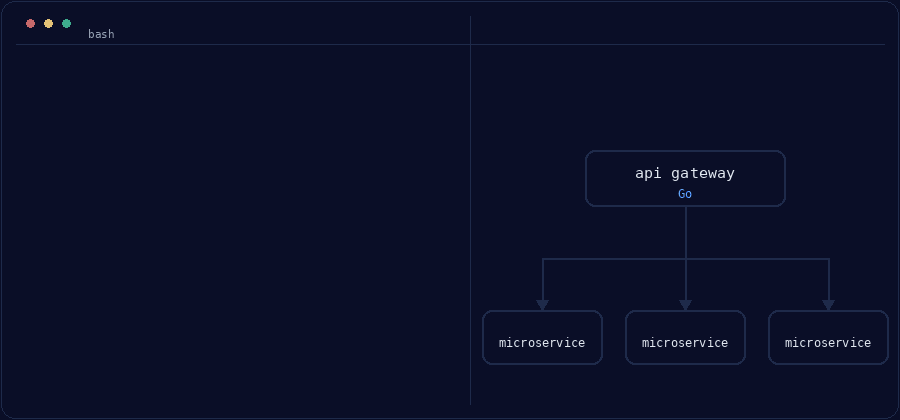

# Hi, I'm Dodi Rusmana

Backend engineer. [KENTANG TECH](https://kentangtech.com). I build services, CLIs, and web tooling in Go, TypeScript, and Python.

---

## See it in action

  

A Go API gateway sits in front of independently built services. Each service is a
separate module with its own `cmd/` binary, so they build, ship, and fail on their
own. The gateway owns the public contract (auth, routing, request and response
shapes); the services behind it own their own data and keep their own release cycle.

---

## Stack

- **Go** for APIs, services, and concurrency-heavy tooling
- **TypeScript** for web apps and Node tooling
- **Python** for scripts, automation, and data work

## Stats

## Activity

## Support

## Find me

- GitHub: [rusmanadodi2598](https://github.com/rusmanadodi2598)
- Web: [kentangtech.com](https://kentangtech.com)